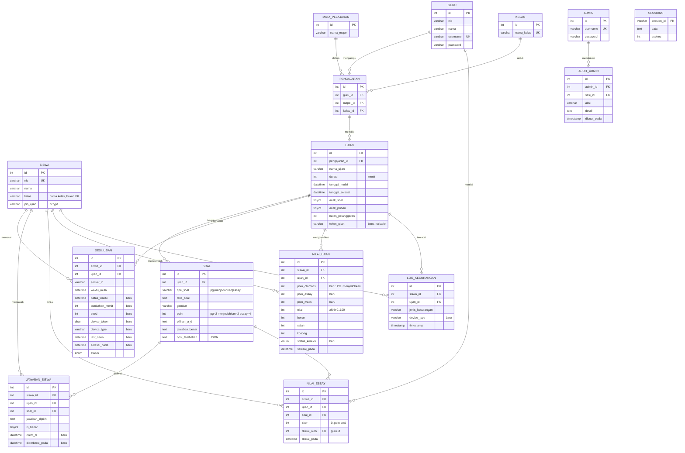

# ERD — CBT Sekolah

Dokumen terkait: [DESIGN](DESIGN.md), [PRD](PRD.md). Baseline: `database/schema.sql`. Perubahan lewat `database/migrations/NNN_*.sql` (D-013).

## 1. Diagram target

Kolom bertanda "baru" belum ada di `database/schema.sql` dan ditambahkan lewat migrasi.

## 2. Aturan integritas
- `UNIQUE (siswa_id, ujian_id)` pada `sesi_ujian` dan `nilai_ujian`.
- `UNIQUE (siswa_id, ujian_id, soal_id)` pada `jawaban_siswa` dan `nilai_essay`.
- Seluruh FK `ON DELETE CASCADE` (kecuali `nilai_essay.dinilai_oleh` → `ON DELETE SET NULL`, dan `audit_admin.admin_id` → `SET NULL`).
- `siswa.kelas` menyimpan **nama** kelas (dipertahankan agar import Excel sederhana); validasi kecocokan dengan `kelas.nama_kelas` ujian dilakukan di aplikasi saat login.
- `sesi_ujian.status`: `sedang_ujian | selesai | keluar_paksa`. Online/offline **diturunkan** dari `last_seen`, bukan disimpan.
- `nilai_ujian.status_koreksi`: `menunggu_essay | selesai`.
- `soal.tipe_soal`: `pg | menjodohkan | essay`.
- `jawaban_siswa.jawaban_dipilih`: PG = huruf (`A`–`D`); menjodohkan = JSON array pasangan; essay = tidak dipakai.
- `nilai_essay.skor` harus `0 ≤ skor ≤ soal.poin` (divalidasi aplikasi).

## 3. Migrasi yang direncanakan
| No | File | Isi |
|----|------|-----|
| 001 | `001_ketahanan_sesi.sql` | `sesi_ujian`: `batas_waktu`, `tambahan_menit`, `seed`, `device_token`, `device_type`, `last_seen`, `selesai_pada`; `jawaban_siswa`: `client_ts`, `diperbarui_pada`; tabel `sessions` (bila store butuh dibuat manual) |
| 002 | `002_penilaian.sql` | tabel `nilai_essay`; `nilai_ujian`: `poin_otomatis`, `poin_essay`, `poin_maks`, `status_koreksi`; atur default `soal.poin` |
| 003 | `003_monitor_antikecurangan.sql` | tabel `audit_admin`; `ujian.token_ujian`; `log_kecurangan.device_type` |

Setiap migrasi: idempoten bila memungkinkan, dicatat di tabel `schema_migrations(nama, dijalankan_pada)`, dan **tidak menghapus data**. Sebelum migrasi di server nyata, lakukan backup.

## 4. Catatan data
- Data siswa asli tidak boleh masuk repo, dump, atau log. Gunakan data sintetis untuk pengembangan.
- `*.sql` diabaikan git kecuali `database/schema.sql` dan `database/migrations/*.sql`.
